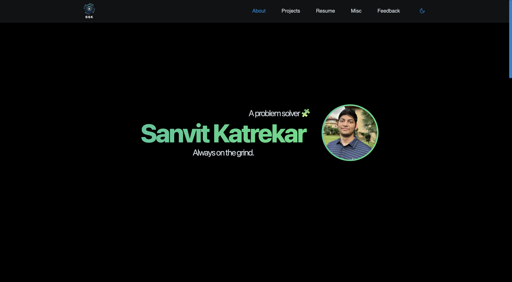

# Portfolio Web Application

This is the source code for my personal portfolio website.

# Tech stack

1. Remix + Shadcn/UI + Tailwind (Frontend)
2. SpringBoot for REST API service (Backend)

# TODO

* Complete admin interface:
    * Admin authentication
    * CRUD for projects page
    
* Implement AI check for comments
    * Flag for toxic comments
    * Display tone of comment

* Checkout deployment options
* Checkout domain options